# Blocker Score

The plan for adding a **blocker score** to the equity engine's settled result:
one number per card pair, per opponent, saying how much holding that card pair
weakens the opponent's range through card removal. This document describes the
diff — what is about to be built and how completion is verified. Once the change
lands, what became true is absorbed into
[specs/equity-analysis.md](../specs/equity-analysis.md) and
[glossary.md](../glossary.md), and this document stays as the record of the
plan as it was approved.

## Summary

Every equity calculation already walks every runout exhaustively and, inside
the native engine, keeps a per-card-pair accounting of how each player's own
card pairs performed. That accounting is folded into 20 histogram bin counts
before it crosses into JavaScript, so nothing about an individual card pair
reaches the app. This change computes, at settlement only, a **blocker score**
for every player's every live card pair against every other player — the
mean-equity shift that holding the pair inflicts on that opponent's range — and
carries those scores and each card pair's own equity across the native
boundary as two fixed-layout byte buffers per player, indexed by a card pair
number both sides derive the same way. Progress ticks are left exactly as they
are: the maintainer intends to raise the progress rate from 10 Hz towards
20–30 Hz, and a per-tick payload of this size would work against that. No
screen renders the score in this change; the deliverable is the computation,
its contract, and its documentation.

## Todo

- Add `Blocker Score` to the glossary's Equity Analysis section, and describe
  the settled per-card-pair scores and equities in the equity-analysis spec's
  account of the engine.
- Record the decision to define the score as a mean-equity shift rather than
  a threshold share, computed per opponent, carried at settlement only, and
  laid out by card pair number in fixed-size buffers.
- Compute the scores in the `espada-engine` Rust crate's equity job from the
  per-card-pair accounting it already keeps, and extend the C ABI's per-player
  result with the two variable-length `f64` arrays.
- Copy the two arrays through the C++ bridge into owning Nitro byte buffers,
  and extend the Nitro spec's per-player result type with them.
- Pass the two fields through the module's TypeScript wrapper and the app's
  equity evaluation store, with an accessor in the evaluations feature's
  model layer that reads one score by player, opponent, and card pair, and
  one equity by player and card pair, and a shared card pair numbering both
  the engine and the app derive from the deck order.
- Add tests at each tier: the Rust crate, the TypeScript wrapper, and the app
  store.
- Regenerate the Nitro bindings and rebuild the committed native binaries
  through the artifacts workflow.
- Open the follow-up issue for persisting the scores and equities in a
  history entry, which needs its own normalised storage rather than an
  extension of issue #178.
- Add this document's two entries — the index line and the routing row — and
  keep them current if the document moves.

## Background

- The native engine walks every runout exhaustively (not Monte Carlo) for a
  table of two or three players; issues #41 and #42 extend that walk to four
  and five players and stop there, because at six the closed form no longer
  beats plain enumeration. The maintainer confirmed on 2026-09-04 that five
  is the ceiling this contract is sized for. Inside the `espada-engine`
  crate, each player's accumulator keeps both an aggregate and a map from
  card pair to its own win/tie/share/total totals, folded from the same rows.
  The map is keyed by suit-specific card pairs on every street, preflop
  included: the preflop walk's suit-isomorphism reduction saves hand
  evaluations, but it still emits one row per actual board with the actual
  suits, so a range of `AA,KK` produces exactly its 12 suit-specific keys. A
  row's weight is the card pair's own weight in its range, never an
  isomorphism multiplicity, and it was 1.0 on every row of every run below.
- Only a fixed-size result crosses the C ABI today: `win`, `tie`, `equity`, and
  a 20-element array of bin counts. The C++ bridge copies it into the
  Nitrogen-generated struct; the app never sees a card pair's identity or its
  own equity. Settlement runs on whichever worker thread merges the last
  shard, and the per-player result array lives on that thread's stack for
  exactly the duration of the settle callback. The crate already passes a
  string out the same way — the error message on a failed job is a C string
  valid only for the call.
- The map holds keys that are dead for reasons other than the board. When an
  opponent's whole range shares a card with a hero card pair — an opponent
  entered as exact hole cards — the hero pair still gets rows, each with a
  total weight of zero, and its accumulated total stays at zero for the whole
  walk. The histogram already skips such keys by requiring a positive total;
  "live" below means the same thing.
- Hand ranges are unweighted sets of rank pairs. The app enumerates the deck
  as ranks two through ace, each in the suit order spades, hearts, diamonds,
  clubs; the engine's own rank ordinal runs the other way, so a shared card
  number has to be stated rather than assumed.
- How the Nitro boundary converts values, verified against the pinned
  `react-native-nitro-modules` 0.37.0 and `nitrogen` 0.37.1 by reading their
  source and by running the generator on a copy of the module's spec: a
  `number[]` or `string[]` field is converted on the JavaScript thread, one
  JSI call per element, with no typed-array fast path; a string element
  additionally allocates one JavaScript string. An `ArrayBuffer` field is
  wrapped in one O(1) call with no byte copy, the native buffer staying alive
  as long as the JavaScript object does. A native buffer made by
  `ArrayBuffer::copy` owns its bytes and may be created on any thread; only
  the wrap happens on the JavaScript thread, which Nitro's own dispatcher
  already guarantees for a `void` callback. The generator accepts `string[]`,
  extra `number[]`, and `ArrayBuffer` fields in this struct and changes only
  the struct's own header; the `ArrayBuffer` name must be the global type,
  not an import.
- Progress callbacks are capped at one per 100 ms inside the engine, and
  nothing on the app side throttles them further. The maintainer plans to
  raise that cap towards 20–30 Hz. The app's evaluation store keeps progress
  and settled results in one map with no field telling them apart.
- History persistence (issue #178, in flight) stores each player's `win`,
  `tie`, and `equity` beside the inputs, and not the histogram; nothing
  carries the new buffers into storage, and the maintainer decided on
  2026-09-04 that persisting them is later, separate work with its own
  normalised storage.
- The app's instrumentation layer wraps error reporting and user feedback
  only; it records no performance measurement today. The maintainer decided
  on 2026-09-04 that this change records nothing either, and only fixes
  where a measurement would go if one is wanted — see System design.
- No concept named "blocker" or "card removal" exists in the product, the app,
  or the documentation yet; "card removal" appears only as engine-internal
  terminology. The equity-analysis spec's one unbuilt piece — a per-bin list
  of card pairs — anticipates per-card-pair data reaching the app, and the
  maintainer decided on 2026-09-04 to carry each card pair's own equity in
  this change so that list can be built from the same payload.
- Three experiments were run against the `espada-internal` crate on
  2026-09-04. Their settings, results, and timings are the evidence the rest
  of this document rests on.

### The experiments

Board K♠7♠2♣, heads-up. Player 1 (hero):
`22+,A2s+,K9s+,Q9s+,J9s+,T9s,98s,87s,76s,65s,A9o+,KTo+,QTo+,JTo` — 284 live
card pairs. Player 2 (opponent):
`AA,KK,77,22,AKs,AKo,KQs,KQo,KJs,KJo,KTs,KTo,AQs,AQo,QJs,QJo,JTs,JTo,T9s,98s,A5s,A4s,A3s,A2s,65s,54s,J9s,T8s,Q9s`
— 154 live card pairs. The opponent's per-card-pair equity `e(v)` ranged from
0.95 (KK) through 0.93 (77), 0.92 (22), 0.88 (A♠Kx, A♠Ax) down to 0.16–0.18
(suited connectors); its mean was 0.528 and its 75th percentile 0.781.

Two definitions were computed for every hero card pair `h`:

- **Threshold share** — the fraction of the opponent's card pairs with
  `e(v) ≥ τ` that `h` blocks, for τ = 0.60, τ = 0.75, and τ = the opponent's
  own 75th percentile.
- **Mean-equity shift** — `Δ(h)` = mean of `e(v)` over the opponent's live
  card pairs, minus the mean over those `h` does not block.

| Hero pair | Own equity | Share τ=.60 | Share τ=.75 | Share top ¼ | Δ (pp) | Pairs blocked |
| --------- | ---------- | ----------- | ----------- | ----------- | ------ | ------------- |
| A♠K♥      | 0.823      | 0.385       | 0.370       | 0.381       | +5.75  | 31            |
| A♥K♦      | 0.789      | 0.354       | 0.370       | 0.381       | +4.54  | 31            |
| Q♠Q♦      | 0.541      | 0.108       | 0.111       | 0.143       | −0.45  | 24            |
| Q♥Q♦      | 0.505      | 0.092       | 0.111       | 0.143       | −1.21  | 24            |
| 7♥7♣      | 0.919      | 0.046       | 0.056       | 0.071       | +0.80  | 3             |
| J♥T♦      | 0.235      | 0.092       | 0.056       | 0.000       | −2.15  | 20            |
| A♠5♠      | 0.614      | 0.123       | 0.111       | 0.143       | +1.65  | 16            |

What the table shows, and why the mean-equity shift was chosen:

- The threshold share changes with τ in ways that have no principled
  resolution: J♥T♦ reads 0.092, 0.056, or 0.000 depending on the cutoff. The
  product already treats strength as a continuous gradient with no band
  boundary, and no τ is consistent with that.
- The threshold share cannot tell apart two pairs that block the same number
  of strong holdings. A♠K♥ and A♥K♦ tie at 0.370; Δ separates them (5.75 vs
  4.54) because the spade ace removes the opponent's highest-equity A♠Kx and
  A♠Ax holdings. Q♠Q♦ and Q♥Q♦ tie the same way.
- The threshold share cannot go negative. J♥T♦ removes twenty of the
  opponent's weak holdings (KJo, QJ, JT, J9, T9, T8) and thereby makes the
  remaining range stronger; Δ = −2.15 shows that, a threshold share cannot.
- The threshold share counts holdings; Δ weighs them. 7♥7♣ blocks three
  holdings and scores near zero by count, but the three are the 0.93 sets, so
  Δ = +0.80.

Over all 284 hero pairs, Spearman rank correlation between Δ and the τ=0.75
share was 0.72, between Δ and the top-quartile share 0.82, and between Δ and
the hero pair's own equity 0.74. The orderings agree in the large and differ
exactly where the four points above apply. The 0.74 against own equity means
Δ carries hand strength with it — KK tops both lists — which is inherent to
blocking (strong holdings block strong holdings). The maintainer decided on
2026-09-04 not to define a strength-neutral variant in this change; nothing
here forecloses adding one.

Three-way, same board, with a third player holding a wide weak range
(`TT-22,A9s-A2s,K9s-K2s,Q9s-Q2s,J9s-J7s,T9s-T7s,98s-97s,87s-86s,76s-75s,65s-64s,54s-53s,A8o-A2o`,
267 live pairs): 56 of the hero's 284 pairs had a Δ of opposite sign against
the two opponents (A♣K♣: +4.23 against player 2, −0.02 against player 3), and
the two per-opponent orderings correlated at only 0.52. An average across
opponents would hide a pair that blocks one opponent and not the other, and
costs nothing less to compute since it is derived from the per-opponent
values. The per-opponent Δ also already reflects the whole table: the same
hero pair's Δ against player 2 differs between the heads-up and three-way runs
(A♠K♥: 5.75 vs 5.46) because `e(v)` itself is the three-way equity.

Preflop, `AA,KK` against `QQ+,AKs`: the walk covered all 2,598,960 boards in
3.1 s; every one of the hero's six AA pairs scored +11.86 pp against the
opponent and every KK pair −6.39 pp. The signs are what a player expects: AA
removes the opponent's AA and two of the AKs, KK removes only holdings the
opponent's AA beats. Suit symmetry held exactly within each rank pair.

Against an opponent entered as exact hole cards (A♥K♥ on K♠7♠2♣): the hero's
284 keys included 47 that share a card with A♥K♥, every one with a total of
zero; the 237 with a positive total contained neither card, and Δ was exactly
0 for all of them, as it must be when the opponent has one holding and no live
hero pair blocks it.

Δ was defined for every live hero pair in every run, including tight cases
(`AA` against `AA`, `AKs` against `AKs`, an ace-high flop, and rivers). That
follows from the walk: a hero pair has a positive total only if some runout
deals it beside a non-colliding holding of every opponent, so at least one of
each opponent's live pairs is always unblocked. One river board left both
players with no live pair at all, which is a different outcome — no pair to
score, not a pair with an undefined score.

Three encodings of the settled payload were built from the same scores and
checked to decode to identical (card pair, opponent, score) triples: string
codes with plain arrays, a fixed layout of all 1,326 card pair slots with
`NaN` in the slots that are not live, and a sparse layout listing only live
pair numbers. Building the fixed layout was 10–20 times cheaper than building
the string codes at every table size, because the codes are 1,326 string
allocations per player; the sparse layout saved bytes only when ranges were
narrow, which does not matter for a payload that crosses once per job.

Timings, release build on the session host, median of five runs. The walk is
the existing work; everything below it is what this change adds at
settlement. The synthetic rows give every player all 1,326 card pairs with
pseudo-random equities, the worst case the contract allows.

| Measurement                                                     | Time    |
| --------------------------------------------------------------- | ------- |
| Exhaustive walk, three players, flop                            | 226 ms  |
| Exhaustive walk, three players, turn                            | 14 ms   |
| Exhaustive walk, three players, river                           | 0.4 ms  |
| Δ for all six ordered player pairs, three players, any street   | 0.05 ms |
| The same by naive double loop                                   | 5.1 ms  |
| Three players synthetic: per-card sums                          | 0.02 ms |
| Three players synthetic: Δ for all 6 ordered pairs              | 0.24 ms |
| Three players synthetic: filling both fixed-layout buffers      | 0.03 ms |
| Three players synthetic: the same as string codes, for contrast | 0.44 ms |
| Five players synthetic: per-card sums                           | 0.04 ms |
| Five players synthetic: Δ for all 20 ordered pairs              | 0.79 ms |
| Five players synthetic: filling both fixed-layout buffers       | 0.07 ms |
| Five players synthetic: the same as string codes, for contrast  | 0.78 ms |

The synthetic rows for a table sum to what the non-functional requirements
below cite, 0.3 ms for three players and 0.9 ms for five. The settlement cost
does not depend on the street, only on the live pair counts, which barely
change from flop to river. The fast path and the naive loop agreed to within
1e-9 on every card pair of every ordered pair in every run.

### Assumptions

- Hand ranges stay unweighted, so every mean is an unweighted mean over live
  card pairs. Verified: every row's weight was 1.0 in every run.
- The opponent's per-card-pair equity from the same walk is an adequate
  strength measure even though it averages over a hero range that includes
  the scoring pair itself. Inferred: one pair's share of a range of hundreds
  is a second-order effect; not measured separately.
- A `Float64Array` view over the `ArrayBuffer` the app receives reads the
  engine's `f64` values, `NaN` included, without further conversion.
  Inferred from JavaScript semantics; Nitro documents no alignment or
  detachment caveat for a buffer it created.
- One copy of at most 265 KB per job at settlement, plus two O(1) buffer
  wraps per player on the JavaScript thread, is acceptable on a device.
  Assumed; unmeasured on a device.

## Goals and Non-goals

- Ensure every settled successful result carries, for each player, a blocker
  score for each of that player's live card pairs against each other player,
  and that card pair's own equity.
- Ensure the score needs no threshold and is expressed in equity's own unit,
  a signed fraction, so a negative value reads as an unblocking effect.
- Ensure the scores are per opponent, never only an aggregate across
  opponents.
- Ensure the work the JavaScript thread does at settlement does not grow
  with the number of card pairs, so the payload never competes with the
  planned faster progress rate.
- Ensure the existing aggregate, histogram, progress, and status behaviours
  are unchanged for every input.
- Ensure the contract needs no change up to the five-player ceiling issue #42
  sets: the layout is a function of the player count, and the computation is
  linear per ordered pair of players.
- Avoid carrying either buffer on progress ticks — a maintainer decision
  taken on 2026-09-04 in view of the planned 20–30 Hz progress rate.
- Avoid rendering the score or the equities anywhere; no screen, sheet, or
  row changes.
- Avoid a strength-neutral variant of the score, weighted ranges, and the
  four-or-five-player walk itself; each is a separate change.
- Avoid persisting the buffers in a history entry; that is the follow-up
  issue named under Todo, with its own normalised storage.
- Avoid recording or sending any performance measurement; this change only
  fixes the measurement point.

## Functional requirements

The beneficiary is the developer consuming the engine's settled result from
the app's evaluation store; nothing changes for the app's user in this change.

- Every card is numbered `rank × 4 + suit`, where rank runs 0 for a deuce to
  12 for an ace and suit is 0 for spades, 1 for hearts, 2 for diamonds, 3 for
  clubs — the position of the card in the app's own deck enumeration. Every
  card pair is numbered by its two card numbers `a < b` as
  `a × 51 − a × (a − 1) / 2 + (b − a − 1)`, which maps the 1,326 pairs onto
  `0` to `1325` one to one: 2♠2♥ is 0, 2♦2♣ is 101, A♠A♥ is 1320, A♦A♣ is
  1325.
- A settled successful result carries, per player, two buffers of 64-bit
  floats: one equity per card pair number, and one blocker score per (card
  pair number, opponent). The equity buffer holds 1,326 values; the score
  buffer holds 1,326 × (players − 1), row-major, so the score for pair `p`
  and opponent ordinal `o` is at `p × (players − 1) + o` and the equity for
  pair `p` is at `p`.
- A card pair is live when its accumulated total weight is positive — the
  same test the histogram applies. A pair that is not live has `NaN` in its
  equity slot and in every one of its score slots; a live pair has a finite
  value in all of them. The set of live pairs is therefore the set of
  non-`NaN` equity slots.
- The score for hero card pair `h` against opponent `j` is
  `Δ_j(h) = mean(e_j(v) for v in R_j) − mean(e_j(v) for v in R_j not sharing a card with h)`,
  where `R_j` is the set of opponent `j`'s live card pairs and `e_j(v)` is the
  opponent's own per-card-pair equity from the same walk.
- The score is a signed fraction of equity in `[−1, 1]`: positive means holding
  `h` leaves the opponent a weaker range; negative means a stronger one.
- A card pair's own equity is its accumulated share divided by its
  accumulated total, a fraction in `[0, 1]` — the same number the histogram
  bins that pair by.
- Opponents are ordered by seat, skipping the scoring player: `o` is the
  opponent's seat index, minus one when the opponent sits past the scoring
  player. For the player in seat 1 of a three-seat table, seats 0 and 2 are
  ordinals 0 and 1.
- An opponent entered as exact hole cards contributes a column of zeros in
  every live row.
- Both buffers are empty on every progress tick, so a non-empty buffer is
  itself the sign that a result is settled.
- Cancelled, error, no-valid-runout, and unsupported-player-count outcomes are
  unchanged.
- The scores and equities exist on every street, preflop included.

### UI design

Omitted: this change alters no view.

### System design

The score is computed where the per-card-pair accounting already lives, at the
one moment the accounting is complete, and crosses the boundary as bytes in a
fixed layout, so the JavaScript thread wraps two buffers per player instead
of converting tens of thousands of values.

```mermaid
flowchart LR
  walk["Exhaustive runout walk\n(espada-internal)"] --> acc["Per-player accumulator\naggregate + card pair → totals\n(espada-engine)"]
  acc -->|"settle only"| ev["Per-card-pair equity e(v)\nper player, positive totals only"]
  ev --> delta["Blocker scores Δ\nper (player, opponent, card pair)"]
  delta --> fill["Fixed-layout f64 arrays\nby card pair number, NaN where not live"]
  fill --> cabi["C ABI result\nblockerScores, cardPairEquities:\nptr+len each"]
  cabi --> bridge["C++ bridge\nArrayBuffer::copy, owning"]
  bridge --> nitro["Nitro result\nArrayBuffer, ArrayBuffer\n(one O(1) wrap each, JS thread)"]
  nitro --> store["App evaluation store\nFloat64Array views"]
```



**Ownership.** The `espada-engine` crate owns the computation: a pure function
from (each player's card pair → equity map over positive totals) to the two
per-player arrays, called once by the settle path after the last shard
merges, on that worker thread. The `espada-internal` crate is untouched; it
exposes runout rows and no aggregate, and this change keeps that boundary.
The C ABI result owns its arrays for the duration of the settle callback
exactly as it owns the per-player array today — the two `f64` arrays are
locals of the settle path, like the error message already is. The C++ bridge
copies each into an owning native buffer before the callback returns, on the
worker thread, which Nitro permits for a buffer it did not borrow from
JavaScript; the buffer then lives as long as the JavaScript object that wraps
it. The app's evaluations feature owns the card pair numbering on its side,
derived from its own deck enumeration, and the accessor that turns (player,
opponent, card pair) into one score and (player, card pair) into one equity
by indexing a `Float64Array` view.

**The fast path.** For an opponent `j`, precompute `S = Σ e(v)`, `N = |R_j|`,
and for each of the 52 cards `c` the sums `S_c = Σ e(v) over v ∋ c` and
`N_c = |{v ∋ c}|`. For hero pair `h = {a, b}`, the blocked mass is
`S_a + S_b − e({a,b}) if {a,b} ∈ R_j`, the blocked count
`N_a + N_b − 1 if {a,b} ∈ R_j`, and
`Δ = S/N − (S − blocked mass)/(N − blocked count)`. That is linear in
`|R_i| + |R_j|` per ordered pair, the 0.05 ms above, and it is checked against
the naive double loop in the crate's tests. The arrays are filled with `NaN`
first and then written at the live pairs' numbers, so a slot is finite
exactly when its pair is live.

**The contract.** The two new fields on the existing per-player result type
are the contract this change delivers, so they are named here as acceptance
criteria rather than illustrated:

```ts
interface EspadaEquityPlayerResult {
  win: number;
  tie: number;
  equity: number;
  distribution: number[];
  // 1,326 × (players − 1) float64 values, row-major by card pair number
  // then opponent ordinal; NaN where the pair is not live; empty on a
  // progress tick
  blockerScores: ArrayBuffer;
  // 1,326 float64 values by card pair number; NaN where the pair is not
  // live; empty on a progress tick
  cardPairEquities: ArrayBuffer;
}
```

On the C side each becomes a pointer-and-length pair, beside the fixed-size
fields the struct already has. A progress tick passes null and zero for both,
which the bridge turns into two empty buffers, so one struct serves both
callbacks and the progress path allocates nothing of note. The `ArrayBuffer`
in the spec is the global type; the generator finds no spec at all if it is
imported from the Nitro package.

**The measurement point.** If the settlement cost is ever to be watched in
the field, the number to record is the wall time in the app from starting a
job to receiving its settled result, tagged with the player count and the
total live card pair count. It includes the buffer copy and the wraps, which
a timer inside the settle handler would miss, and it needs no field in the
contract. This change records nothing; it only leaves the store able to take
that measurement without restructuring.

#### Alternatives considered

- **Threshold share of strong holdings blocked.** Rejected on the experiment:
  it depends on a cutoff the product's continuous-gradient design has no
  place for, cannot distinguish pairs that block equally many strong holdings,
  and cannot express an unblocking effect.
- **Plain removal ratio (holdings blocked ÷ holdings in range).** Rejected: it
  scores removing a set the same as removing a busted draw, so it does not
  use the equity the request asks to build on.
- **One score per card pair, averaged across opponents.** Rejected: 56 of 284
  hero pairs had opposite-signed scores against the two opponents in the
  three-way experiment, and the average is computed from the per-opponent
  values anyway, so it saves nothing.
- **Export only the equities and compute the score in TypeScript.** Rejected:
  the equities now cross anyway, but computing the score beside the
  accumulator keeps one place that says what the engine computed, keeps the
  score testable with the crate's own fixtures, and costs under a
  millisecond; a TypeScript re-derivation would be a second implementation to
  keep in step.
- **A list of card pair codes (`string[]`) with plain `number[]` arrays.**
  Rejected by the maintainer on 2026-09-04 after the boundary was read: at
  five players it is about 46,000 per-element JSI calls on the JavaScript
  thread per settlement, 6,630 of them string allocations, and the codes
  cost the engine ten times more to build than the fixed layout. The
  generator does accept the shape; cost, not feasibility, ruled it out.
- **A sparse layout: a `Uint16` buffer of live pair numbers plus the two
  float buffers.** Rejected: it saves bytes only for narrow ranges — 5 KB
  against 21 KB per player at 284 live pairs — for a payload that crosses
  once per job, and it costs a third buffer, a sort, and an index the app
  must build before it can look anything up.
- **Carry the buffers on every progress tick.** Rejected by the maintainer on
  2026-09-04: the payload is sized for once per job, and the progress rate
  is planned to rise to 20–30 Hz. The engine's own cost of 0.2 ms per tick
  was not the reason.
- **Index columns by absolute seat, with a sentinel in the scoring player's
  own column.** Rejected: a consumer averaging a row could silently include
  it, and it wastes one column in five; the skip-self ordinal costs the
  reader one comparison. The `NaN` that marks a pair as not live is a
  different case: it is the absence of a value, not a value, and it poisons
  any aggregate that forgets to test for it instead of biasing it quietly.
- **A strength-neutral variant beside Δ.** Deferred by the maintainer on
  2026-09-04 until a display design says whether one is wanted.
- **An engine-reported timing field.** Rejected with the measurement point
  above: it would give a breakdown at the cost of a contract field, and the
  number that matters on a device is the end-to-end one the app can already
  take.

## Non-functional requirements

- Settlement work added by this change stays under 5 ms on a device for a
  three-player table, and under 10 ms for a five-player one, where every
  player has all 1,326 card pairs live. The host measurements were 0.3 ms
  and 0.9 ms respectively.
- The settlement cost is independent of the street; it is bounded by the live
  pair counts alone.
- The work the JavaScript thread does at settlement is two buffer wraps per
  player, independent of the card pair count.
- A progress tick's payload is byte-for-byte what it is today.
- The settle payload grows by a fixed 10,608 × players bytes for the equities
  and 10,608 × players × (players − 1) bytes for the scores, once per job:
  about 95 KB for three players and 265 KB for five, regardless of range
  width.
- The scores and equities are deterministic: the same board and ranges
  produce identical buffers on every run, independent of the accumulator's
  hash order and of thread scheduling.
- No new dependency in either Rust crate, the bridge, or the module's
  TypeScript.
- No panic or exception crosses the C ABI in either direction; the existing
  catch-everything rule for `extern "C"` callbacks continues to hold for the
  enlarged struct.
- Rollback is a revert of the change plus one dispatch of the artifacts
  workflow to restore the previous bindings and binaries; the fields are
  additive and nothing persists them.

## Acceptance criteria

- A settled `Success` result for a two- or three-player table carries, per
  player, a `cardPairEquities` buffer of 10,608 bytes and a `blockerScores`
  buffer of 10,608 × (players − 1) bytes; the count of finite equity slots
  equals the sum of that player's `distribution`, and a score slot is finite
  exactly when its row's equity slot is.
- The card pair numbering is the same on both sides: the engine and the app
  each map 2♠2♥ to 0, 2♦2♣ to 101, A♠A♥ to 1320, and A♦A♣ to 1325, and the
  app's numbering of its whole deck enumeration is a bijection onto `0` to
  `1325`.
- Binning each player's finite equity slots into the histogram's 20
  equal-width slices, with the same boundary rule the histogram uses,
  reproduces that player's `distribution` exactly.
- The experiments reproduce as fixtures, each value within 1e-4: on K♠7♠2♣
  with the two ranges above, player 1 against player 2 scores A♠K♥ +0.0575,
  A♥K♦ +0.0454, J♥T♦ −0.0215, 7♥7♣ +0.0080, with own equities 0.823, 0.789,
  0.235, 0.919 within 1e-3, and KK's three pairs rank first; in the
  three-way run A♣K♣ scores +0.0423 at ordinal 0 and −0.0002 at ordinal 1;
  preflop, `AA,KK` against `QQ+,AKs` scores every AA pair +0.1186 and every
  KK pair −0.0639.
- The fast path and a naive double loop agree within 1e-9 on every card pair
  of every ordered player pair, for a fixture covering preflop, a flop, a
  turn, and a river.
- Against an opponent entered as exact hole cards (A♥K♥ on K♠7♠2♣ against
  the hero range above), the hero has 237 finite equity slots, none of them
  at a pair number containing A♥ or K♥, and that opponent's column is zero
  in every finite row.
- Every progress tick's per-player result has two empty buffers, and its
  `win`, `tie`, `equity`, and `distribution` are unchanged for the same
  inputs.
- For the same board and ranges, the settled `win`, `tie`, `equity`, and
  `distribution` are unchanged from before this change, and `Cancelled`,
  `Error`, `NoValidRunout`, and `UnsupportedPlayerCount` outcomes carry what
  they carry today.
- The glossary defines `Blocker Score`, the equity-analysis spec describes
  the settled scores and equities, a decision record holds the definition,
  the settle-only choice, and the fixed layout, the follow-up issue for
  history persistence exists, and both of this document's entries exist.

## Verification strategy

1. Run, from the repository root, both crates' format, lint, and test
   invocations as the README lists them; all pass, including the new tests
   for the score function: fast path against naive loop across the four
   streets, the fixture values above, the pair numbering fixtures, the
   histogram reproduced from the finite equity slots, the exact-hole-cards
   column, the `NaN` marking of every non-live slot, and the unchanged
   aggregate outputs.
2. Run `npm run format`, `npm run lint`, `npm run typecheck`, and
   `npm run test:unit`; all clean, with the module's wrapper tests and the
   app's store tests driving a mocked hybrid object that delivers the two
   buffers on settle and empty buffers on progress, the app's numbering
   tested against the same four fixtures, and the accessor read through a
   `Float64Array` view. These need only the hand-authored spec, not the
   regenerated bindings.
3. Run the documentation link check and the five `docs/` validators as
   [conventions/documentation.md](../conventions/documentation.md) lists
   them; all exit 0.
4. Dispatch the artifacts workflow so Nitrogen regenerates the bindings from
   the extended spec and both binaries are rebuilt and committed; its
   exported-symbol check passes.
5. On a development build, settle a three-player table and inspect the
   store's settled result: each player's equity buffer is 10,608 bytes and
   its score buffer 21,216 bytes, a `Float64Array` view over each reads
   finite values at exactly the live pairs and `NaN` elsewhere, the count of
   finite equities equals the sum of that player's `distribution`, and an
   exact-hole-cards player's only finite slot is at its own pair number.
   This is a manual step; a cloud session cannot run an emulator.

## Open questions

- Risk: the settlement payload's cost on a device — one copy of up to 265 KB
  and two buffer wraps per player — is unmeasured. Mitigation: the copy and
  the wraps are O(1) in the card pair count by construction, the manual step
  above confirms the buffers arrive intact, and the measurement point under
  System design is where a field measurement would go if the maintainer
  later wants one.
